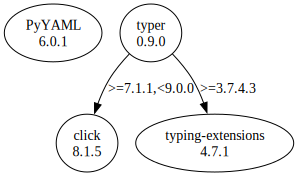

# Third Party Dependencies

<!--[[[fill sbom_sha256()]]]-->
The [SBOM in CycloneDX v1.4 JSON format](https://git.sr.ht/~sthagen/afasi/blob/default/sbom/cdx.json) with SHA256 checksum ([1b13e2e2 ...](https://git.sr.ht/~sthagen/afasi/blob/default/sbom/cdx.json.sha256 "sha256:1b13e2e28bdc1fc9b92f19264d8be1c1fcc6e54d4073999ec466f46d36adf29c")).
<!--[[[end]]] (checksum: fc40d0dfe76e88181a4dc325ebcad05f)-->
## Licenses 

JSON files with complete license info of: [direct dependencies](direct-dependency-licenses.json) | [all dependencies](all-dependency-licenses.json)

### Direct Dependencies

<!--[[[fill direct_dependencies_table()]]]-->
| Name                                       | Version                                         | License     | Author            | Description (from packaging data)                                  |
|:-------------------------------------------|:------------------------------------------------|:------------|:------------------|:-------------------------------------------------------------------|
| [PyYAML](https://pyyaml.org/)              | [6.0.1](https://pypi.org/project/PyYAML/6.0.1/) | MIT License | Kirill Simonov    | YAML parser and emitter for Python                                 |
| [typer](https://github.com/tiangolo/typer) | [0.9.0](https://pypi.org/project/typer/0.9.0/)  | MIT License | Sebastián Ramírez | Typer, build great CLIs. Easy to code. Based on Python type hints. |
<!--[[[end]]] (checksum: 57e70643e2e7dd9ac365b0676b61d886)-->

### Indirect Dependencies

<!--[[[fill indirect_dependencies_table()]]]-->
| Name                                          | Version                                        | License     | Author  | Description (from packaging data)         |
|:----------------------------------------------|:-----------------------------------------------|:------------|:--------|:------------------------------------------|
| [click](https://palletsprojects.com/p/click/) | [8.1.5](https://pypi.org/project/click/8.1.5/) | BSD License | UNKNOWN | Composable command line interface toolkit |
<!--[[[end]]] (checksum: fc083c8a6d9a7dd9891e6168f79bd76b)-->

## Dependency Tree(s)

JSON file with the complete package dependency tree info of: [the full dependency tree](package-dependency-tree.json)

### Rendered SVG

Base graphviz file in dot format: [Trees of the direct dependencies](package-dependency-tree.dot.txt)



### Console Representation

<!--[[[fill dependency_tree_console_text()]]]-->
````console
PyYAML==6.0.1
typer==0.9.0
├── click [required: >=7.1.1,<9.0.0, installed: 8.1.5]
└── typing-extensions [required: >=3.7.4.3, installed: 4.7.1]
````
<!--[[[end]]] (checksum: af47f0f923d16d509c4777db61fb6ea9)-->
